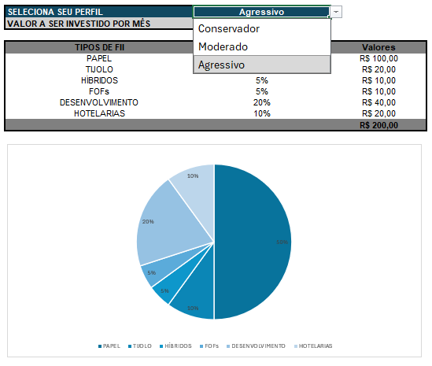
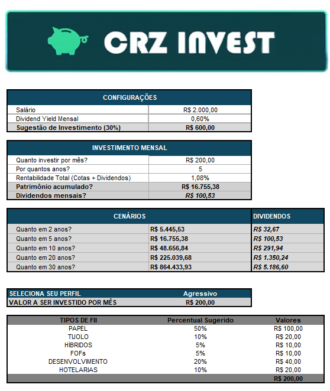

# 📊 Simulador de Investimentos e Alocação em FIIs

## Descrição do Projeto
Projeto desenvolvido como parte da Formação Análise de Dados com Excel e IA da DIO. Trata-se de um simulador financeiro construído no Microsoft Excel que projeta o crescimento do patrimônio e a geração de renda passiva (dividendos) através do investimento em Fundos de Investimento Imobiliário (FIIs). O simulador adapta a estratégia de alocação de ativos com base no perfil de risco do investidor.

## 🚀 Funcionalidades
- **Definição de Perfil de Investidor:** Utiliza Validação de Dados em lista suspensa (Conservador, Moderado, Agressivo) para direcionar a estratégia.
- **Alocação Dinâmica:** Distribuição automática de aportes entre diferentes classes de FIIs (Papel, Tijolo, Híbridos, FOFs, Desenvolvimento e Hotelarias) utilizando a planilha de apoio e funções de busca.
- **Projeção de Juros Compostos:** Cálculo automatizado do Valor Futuro (FV) para cenários de 2, 5, 10, 20 e 30 anos.
- **Estimativa de Dividendos:** Separação entre a rentabilidade total e o *Dividend Yield* mensal esperado para calcular a renda passiva futura.

## 📁 Estrutura dos Arquivos
* `Project_DIO_Invest.xlsx`: Arquivo principal contendo a aba de simulação (`Invest`) e o banco de dados de alocação (`Planilha de Apoio`).
* `/images`: Diretório contendo capturas de tela das funcionalidades e interface da planilha.

## 🛠️ Tecnologias e Técnicas Utilizadas
- **Microsoft Excel**
- Fórmulas Financeiras (Valor Futuro)
- Validação de Dados (Menus Suspensos)
- Modelagem de Dados (Chaves Compostas e Tabelas Auxiliares)

## 📸 Demonstração Visual

